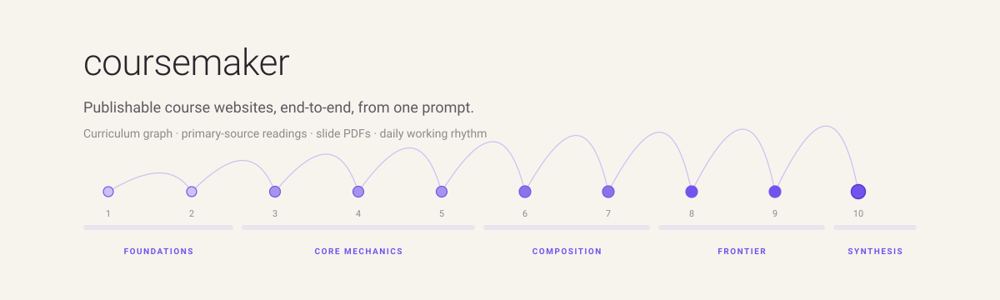

<p align="center">
  
</p>

# coursemaker

A Next.js course-site template plus a small library of Claude Code skills that turn a single topic prompt into a publishable course site, end-to-end. One invocation produces the syllabus, ten weeks of lectures + readings + sections + slide PDFs, four assignments + a capstone, a custom SVG hero, a curriculum graph, and a vetted source library, all wired into a checkable Tasks page learners use as their day-to-day driver.

## What it gives you, in six bullets

- **One prompt, a finished course.** `pnpm dev` and you're already serving the new course at `/c/<slug>` with calendar, lectures, readings, slides, assignments, and a Tasks tracker.
- **Backward-designed pedagogy.** Every week declares Bloom-tagged outcomes (Apply / Analyze / Evaluate / Create); the synthesis week always ends on a Create. Lectures, sections, readings, and exercises are required to deliver at least one outcome each.
- **Readings are the textbook.** No external book to buy. Each week's reading is original writing in TSX, cited from a vetted primary-source library (founder essays, operator newsletters, university course notes, recorded talks, books on the author's own page, platform docs; academic papers only as fallback).
- **Daily working rhythm baked in.** Each week has a 5-weekday × 4-slot grid (morning growth move, customer hour, build block, measure + reflect), plus weekly planning, Friday review, and a mid-course pivot/persevere check. The skill steers against the build-build-build trap on every page.
- **A Tasks page learners actually use.** Every reading, slide deck, section, milestone, and assignment becomes a circular checkbox; progress persists in `localStorage`; checked rows go to 45% opacity with strike-through; per-week and overall progress meters render in real time.
- **Honest defaults, no placeholder fakery.** No invented instructor names, office hours, meeting times, classroom locations, Discord URLs, or grading percentages; the syllabus is a high-level roadmap, not a fake contract. The user fills the real specifics before the term begins.

## Quickstart

```bash
pnpm install
pnpm dev                       # http://localhost:3000
```

Have Claude Code build a whole course end-to-end:

```
/coursemaker-create Make a 10-week course on modern cryptography for CS sophomores.
```

Or scaffold an empty course you'll author by hand:

```bash
pnpm new-course --slug my-course-26au \
  --title "My Course" \
  --full-title "My Course: a one-quarter introduction" \
  --term "Autumn 2026" \
  --weeks 10
```

Reference course sites already in the repo:

- `/c/b2c-10k-mrr-26au`, 10-week B2C → $10k MRR (the canonical reference for the full skill output)
- `/c/grow-on-x-26au`, 6-week creator-growth course (same patterns at 6 weeks)
- `/c/cse457-26sp`, hand-built recreation of an undergrad CS course site (the visual reference)

## What every generated course contains

| Artifact | Count (10-week course) |
|----------|---:|
| Curriculum graph + source library JSON | 2 |
| Hero SVG | 1 |
| Syllabus page (high-level roadmap) | 1 |
| Tasks page (localStorage-backed checklist) | 1 |
| Index pages (Lectures / Sections / Readings / Assignments) | 4 |
| Lecture pages (TSX) | 20 |
| Section worksheets (TSX) | 10 |
| Reading pages (TSX, the textbook) | 10 |
| Slide decks (Marp `.md` source) | 20 |
| Slide PDFs (rendered) | 20 |
| Assignment handouts (TSX, HW1-4 + Capstone) | 5 |
| Staff page (generic, no real names) | 1 |

Total: roughly 75 files per course, plus the JSON metadata used for re-runs.

## Pedagogy

The skill encodes opinionated pedagogy the way a senior instructor would. The most load-bearing ideas:

### Backward design with Bloom verbs

Every week in the curriculum graph declares an `outcomes` array, each entry a `{verb, statement}` pair drawn from the revised Bloom taxonomy (Remember, Understand, Apply, Analyze, Evaluate, Create). Coherence checks enforce that every week has at least one Apply-or-higher outcome and that the Synthesis week has at least one Create. Subagents are told to ensure every lecture, section, reading, or exercise delivers at least one of these.

### Curriculum coherence

Every concept the course teaches gets a kebab-case id. Each week declares `introduces` (new ids) and `depends_on` (prior ids). Before fan-out, the master skill verifies that every `depends_on` id appears in some earlier `introduces`, no forward references. Subagents see only the prior-week concept set plus their week's `introduces`, so they can't accidentally use a concept the learner hasn't met.

### Primary sources, not vibes

A dedicated research pass runs before any week is written. The author hunts for primary sources by field (YouTube channels with named authority for the topic, practitioner essays, operator newsletters, free online textbooks, primary documents), URL-verifies each one, and assembles `tmp/coursemaker/<slug>-sources.json`. The user signs off on the source library before fan-out. Per-week subagents see only the source slice tagged for their week; they cannot hallucinate a source mid-flight.

### Daily working rhythm

Every reading begins with the week's mission (one sentence), learning goals, milestones, metrics to track, and a 5-weekday × 4-slot daily routine table. The four slots are fixed across the whole course: morning growth move (~30 min, includes the daily public output), customer hour (~60 min), build block (~3–4 h, doesn't open until the first two are done), and end-of-day measure + reflect (~15 min). Plus a Sunday weekly plan, a 5-minute daily plan, and a Friday review.

### Public output as a course-tracked metric

For applied / practitioner courses, the rhythm includes a daily public-output mandate: every weekday, one piece of public output (tweet, LinkedIn post, Reddit comment, IH update, TikTok, YT short, blog draft, community post), anything in front of an audience that isn't you. The target is course-tracked (50+ outputs by end of a 10-week course).

### Generated readings, no external textbook

The course's "required reading" is the weekly readings on the site itself. No external book is pushed on the student. Optional "going deeper" pointers link out to canonical books and longer essays, but they are clearly optional.

## How a course gets built

`/coursemaker-create <topic>` runs the master orchestrator. Sketch:

1. **Lock parameters.** Slug, full title, term, weeks (default 10), audience, prerequisites, emphasis, goals. Saved to `tmp/coursemaker/<slug>-brief.json`.
2. **Build the curriculum graph.** Phases (Foundations / Core mechanics / Composition / Frontier / Synthesis), week themes, Bloom-tagged outcomes, milestones, `introduces` / `depends_on` ids. The master shows the user a prose summary for sign-off. Saved to `tmp/coursemaker/<slug>-curriculum.json`.
3. **Research pass.** WebSearch + WebFetch a vetted source library; show prose summary; user signs off. Saved to `tmp/coursemaker/<slug>-sources.json`.
4. **Scaffold the site.** `pnpm new-course --slug <slug> ...` plus the master writes the syllabus, hero SVG, staff page, four index pages, and the Tasks page.
5. **Fan out per-week subagents (parallel).** One subagent per week writes six files: 2 lecture pages, 1 section worksheet, 2 Marp slide decks, 1 reading page. Plus one subagent per assignment (HW1–4 + Capstone) writes a `ProjectSpec`.
6. **Render slides.** `pnpm slides <slug>` builds all PDFs to `public/c/<slug>/slides/`.
7. **Consolidate `index.tsx`.** Master registers every page. Subagents never edit `index.tsx`.
8. **Rewrite the calendar.** Home page uses `WeekModule` (CSE-457-style dt/dd modules), not a wide schedule table.
9. **Verify.** `pnpm typecheck && pnpm build`. Click through `/c/<slug>` and check the Tasks page renders, every link resolves, the calendar reaches every artifact.
10. **Commit (but don't push).** Pushing is the user's call.

## Repo structure

```
content/courses/                Each course lives here as data + components.
  <slug>/
    course.config.ts            SiteConfig: nav, hero, footer, slug, term.
    index.tsx                   Page registry. Built by the master orchestrator.
    pages/
      home.tsx                  Calendar (WeekModule) + course intro.
      syllabus.tsx              High-level roadmap. Custom JSX.
      tasks.tsx                 localStorage-backed checklist (use client).
      staff.tsx                 Generic role description. No real names.
      lectures-index.tsx        Table view of every lecture (or lectures.tsx).
      sections-index.tsx        Table view of every section.
      readings-index.tsx        Table view of every reading.
      hw-index.tsx              Table view of every assignment.
      lectures/wkNN-l{1,2}.tsx  Per-lecture page.
      sections/wkNN.tsx         Per-section worksheet.
      readings/wkNN.tsx         Per-week reading (the textbook).
      hw/{1,2,3,4,capstone}.tsx Per-assignment ProjectPage.
    slides/wkNN-l{1,2}.md       Marp deck source.

public/c/<slug>/
  hero.svg                      Course hero art.
  slides/wkNN-l{1,2}.pdf        Rendered slide PDFs.

components/                     Shared UI primitives. AnchorHeading,
                                WeekModule, Label, LecturePage, ProjectPage.

types/course.ts                 The data contracts: SiteConfig, NavItem,
                                CoursePage, LectureSpec, ProjectSpec, etc.

scripts/
  new-course.mjs                Scaffolder. Creates a course folder + stub
                                files + registers in content/courses/index.tsx.
  build-slides.mjs              Runs Marp to render all slide decks for a
                                course to PDF.

.claude/skills/                 The orchestration logic.
  coursemaker-create/SKILL.md   The master end-to-end skill.
  coursemaker-slides/SKILL.md   Per-lecture deck author.
  coursemaker-readings/SKILL.md Per-week reading author.

tmp/coursemaker/                Generated metadata: brief / curriculum /
                                sources JSON per course. Used for re-runs.
```

## Sidebar and visual conventions

- **Flat sidebar, no dropdowns.** Every top-level nav item lands on a real page. Clicking "Lectures" goes to the lectures index (a clean table), not an expanded tree. The skill explicitly disallows the `children` field on nav items.
- **No anchor link icons.** Headings keep their `id`s for fragment deep-linking but render no `<a>` chain icon next to the text.
- **No search bar in the header.** The header was removed; pages still export a `searchBody` text blob for future use.
- **Tasks page is flat.** Circular SVG checkboxes, bold-uppercase small group headers (Reading / Slides / Section / Milestones / Assignments), week titles at font-weight 800, no left borders or side shadows. Checked items go to 45% opacity with strike-through.

## Skills

### `/coursemaker-create <topic>`

The end-to-end orchestrator described above. Detail and step-by-step are in `.claude/skills/coursemaker-create/SKILL.md`.

### `/coursemaker-slides <course> <lecture>`

Build (or rebuild) a single Marp deck for one lecture in the coursemaker theme. Reads the curriculum row + source slice for that lecture, drafts the deck, renders to PDF.

### `/coursemaker-readings <course> <week>`

Write (or rewrite) a single week's reading page. Used both inside the fan-out and standalone if a reading needs a redo.

## Stack

Next.js 16 (App Router, Turbopack) · React 19 · Tailwind v4 · TypeScript strict · Marp CLI for slide PDFs · Plus Jakarta Sans (system fallback) · pnpm.

## License

MIT.
